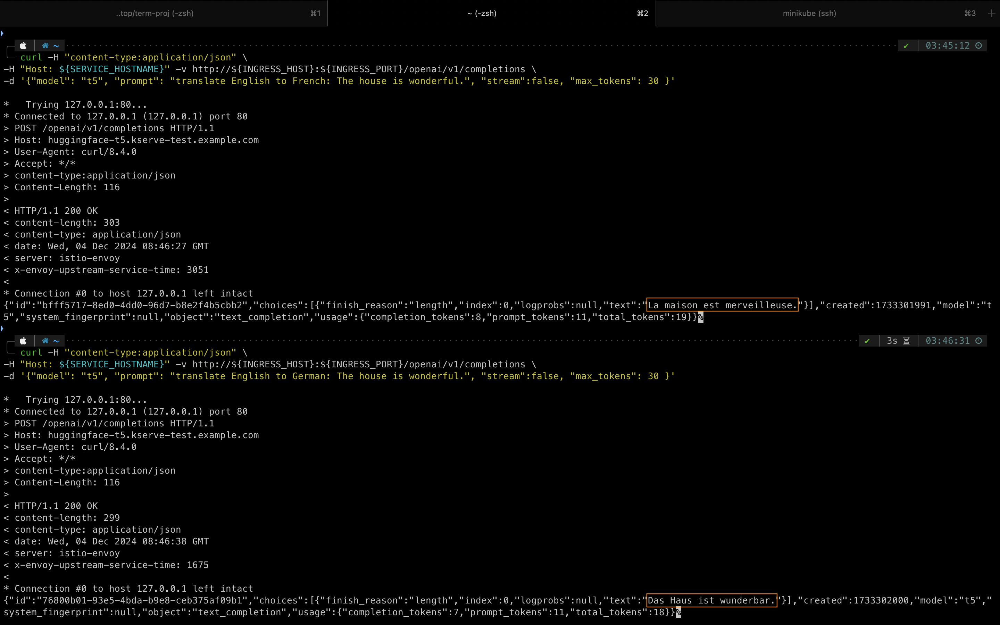

# KServe Model Deployment with Models Web App Integration and Grafana Monitoring

A comprehensive setup for deploying machine learning models using KServe with Minikube on a local cluster, integrating the models web app, and enabling monitoring with Grafana.

## Setup for Model Deployment

1. Install minikube:

   ```bash
   brew install minikube
   ```

2. Start minikube:

   ```bash
   minikube start
   ```

3. Check if the current context is minikube:

   ```bash
   kubectl config current-context
   ```
   
4. Install everything we need:

   ```bash
   curl -s "https://raw.githubusercontent.com/kserve/kserve/release-0.14/hack/quick_install.sh" | bash
   ```

## Deploy Model

> More detailed instructions are also included in the bert and t5 folders, specific to each model.

1. Create a namespace to use for deploying KServe resources:

   ```bash
   kubectl create namespace kserve-test
   ```

2. Create an `InferenceService`:

   ```bash
   # for t5
   cd t5
   kubectl apply -f t5.yaml -n kserve-test
   # for bert
   cd bert
   kubectl apply -f bert.yaml -n kserve-test
   ```

3. Check `InferenceService` status (take around 10 mins to get the expected output for me):

   ```bash
   kubectl get inferenceservices -n kserve-test
   # expected output:
   NAME             URL   READY     PREV   LATEST   PREVROLLEDOUTREVISION   LATESTREADYREVISION   AGE
   huggingface-t5         Unknown                                                                 5m45s
   huggingface-t5         Unknown          100                              huggingface-t5-predictor-00001   9m24s
   huggingface-t5   http://huggingface-t5.kserve-test.example.com   True             100                              huggingface-t5-predictor-00001   9m25s
   huggingface-t5   http://huggingface-t5.kserve-test.example.com   True             100                              huggingface-t5-predictor-00001   9m26s
   ```

4. Since we are using minikube which does not include an external ip by default, to have one, run the following command in a separate window in your terminal:

   ```bash
   minikube tunnel
   ```

   After this command, you should see external ip as `127.0.0.1` with command:

   ```bash
   kubectl get svc istio-ingressgateway -n istio-system
   # expected output
   NAME                   TYPE           CLUSTER-IP     EXTERNAL-IP   PORT(S)                                      AGE
   istio-ingressgateway   LoadBalancer   10.99.39.184   127.0.0.1     15021:30124/TCP,80:31747/TCP,443:31389/TCP   18m
   ```

5. Set ingress host, ingress port, and service hostname:

   ```bash
   export INGRESS_HOST=$(kubectl -n istio-system get service istio-ingressgateway -o jsonpath='{.status.loadBalancer.ingress[0].ip}')
   
   export INGRESS_PORT=$(kubectl -n istio-system get service istio-ingressgateway -o jsonpath='{.spec.ports[?(@.name=="http2")].port}')
   
   # for t5
   export SERVICE_HOSTNAME=$(kubectl get inferenceservice -n kserve-test huggingface-t5 -o jsonpath='{.status.url}' | cut -d "/" -f 3)
   
   # for bert
   export SERVICE_HOSTNAME=$(kubectl get inferenceservice -n kserve-test huggingface-bert -o jsonpath='{.status.url}' | cut -d "/" -f 3)
   ```

   With the following curl commands, you should see:

   ```bash
   # for t5
   curl -H "content-type:application/json" \
   -H "Host: ${SERVICE_HOSTNAME}" -v http://${INGRESS_HOST}:${INGRESS_PORT}/openai/v1/completions \
   -d '{"model": "t5", "prompt": "translate English to German: The house is wonderful.", "stream":false, "max_tokens": 30 }'
   
   # for bert
   curl -H "content-type:application/json" \
   -H "Host: ${SERVICE_HOSTNAME}" -v http://${INGRESS_HOST}:${INGRESS_PORT}/v1/models/bert:predict \
   -d '{"instances": ["The capital of France is [MASK].", "The capital of [MASK] is paris."]}'
   ```

   

## Deploy Streamlit App

> Check the bert and t5 folders for details specific to each model.

## Setup for KServe Models Web App

1. Apply the manifests:

   ```bash
   cd manifests
   kubectl apply -k .
   ```

2. After all the pods are up and run, use port forwarding:

   ```bash
   kubectl port-forward -n kserve svc/kserve-models-web-app 5000:80
   ```

3. Now go to `http://localhost:5000/`, you will find:

   

4. Click on the endpoint detail:

   

5. Grafana dashboard is not there by default, we need to manually add it:

   ```bash
   kubectl apply -f monitoring-core.yaml
   kubectl apply -f monitoring-metrics-prometheus.yaml
   kubectl apply -f grafana-configmap.yaml
   kubectl apply -f grafana-virtualservice.yaml
   kubectl apply -f authorization-policy.yaml
   ```

   After all these commands, you should see:

   ```bash
   kubectl get pods -n knative-monitoring
   # expected output:
   NAME                                  READY   STATUS    RESTARTS   AGE
   grafana-64d59fdffd-st74b              1/1     Running   0          35m
   kube-state-metrics-6477fb45f9-s2v6s   1/1     Running   0          21m
   node-exporter-xmdn8                   2/2     Running   0          19m
   prometheus-system-0                   1/1     Running   0          34m
   prometheus-system-1                   1/1     Running   0          34m
   ```

6. Then we use port forwarding:

   ```bash
   kubectl port-forward -n knative-monitoring svc/grafana 3000:30802
   ```

7. Now go to `http://localhost:3000/`, you will find:

   

   
